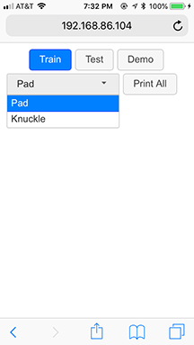
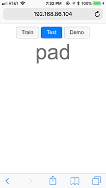
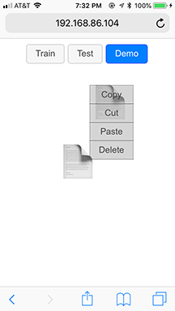

# Knock
Knock uses machine learning to guess whether you are touching the phone's screen with your finger pad or knuckle

By default Knock only uses the following onboard sensors to infer pad vs. knuckle:
- Contact size
- Accelerometer
- Gyroscope

## How to run
Make sure your phone and the machine that runs Knock are under the same wireless network, and finds out the machine's [local IP address](https://lifehacker.com/5833108/how-to-find-your-local-and-external-ip-address).

After downloading or cloning the repo:
```shell
cd knock-master
./serverup 9999
```

Open the browser on your phone, navigate to ```https://<machine_ip_address>:9999```. You will see the UI of Knock.

## Training
Here's the training interface. Unfortunately it is not self-contained. You will need to see and log the data separately in a console. See [here](https://medium.com/@mattcroak718/debugging-your-iphone-mobile-web-app-using-safari-development-tools-71240657c487) if you use an iPhone and [here](https://blog.campvanilla.com/debug-website-on-mobile-device-5c27c8809d39) if Android.



To train recognition for pad or knuckle, simply select the corresponding label from the dropdown list, and use the corresponding hand part to touch the screen.

You should see data being spit out in the console.


Pressing the 'Print All' will give you a table of data ready to be saved as ```.csv``` and sent to Weka.

## Testing
By now you should have learnt how to use Weka to rapid prototype a machine learning model to solve the pad vs. knuckle problem. FYI, an Adaboost model (with a Decision Tree kernel) has been created in ```knock.recognizer.js```.

If you go to the 'Test' mode, you can readily test how well the system can recognize your pad vs. knuckle.



## Demoing
To give you a better sense of how well this technique works in a real application, there is a demo mode you can select, which shows a file explorer with (by default) one file icon. You can use your pad to move a file icon around, and your knuckle to tirgger a context menu.



# References
* Harrison, C., Schwarz, J. and Hudson, S.E., 2011, October. TapSense: enhancing finger interaction on touch surfaces. In Proceedings of the 24th annual ACM symposium on User interface software and technology (pp. 627-636). ACM.
